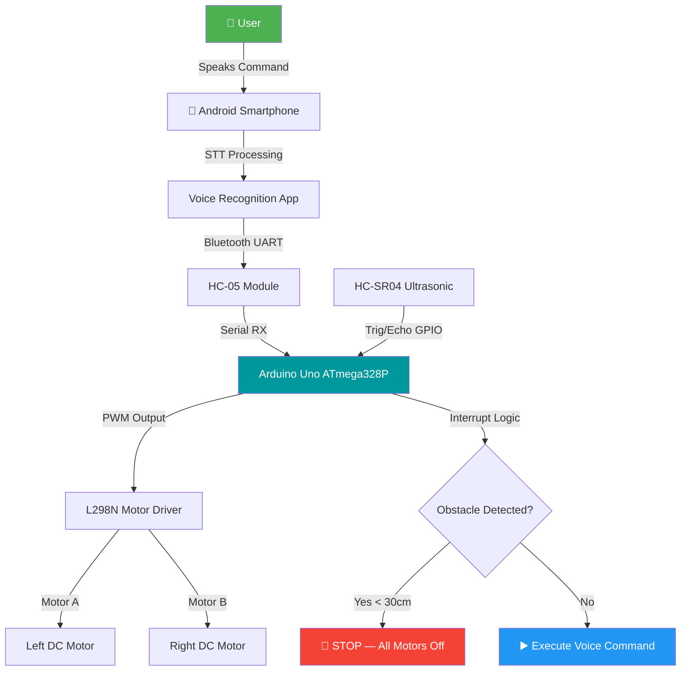
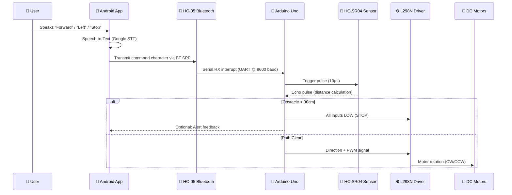
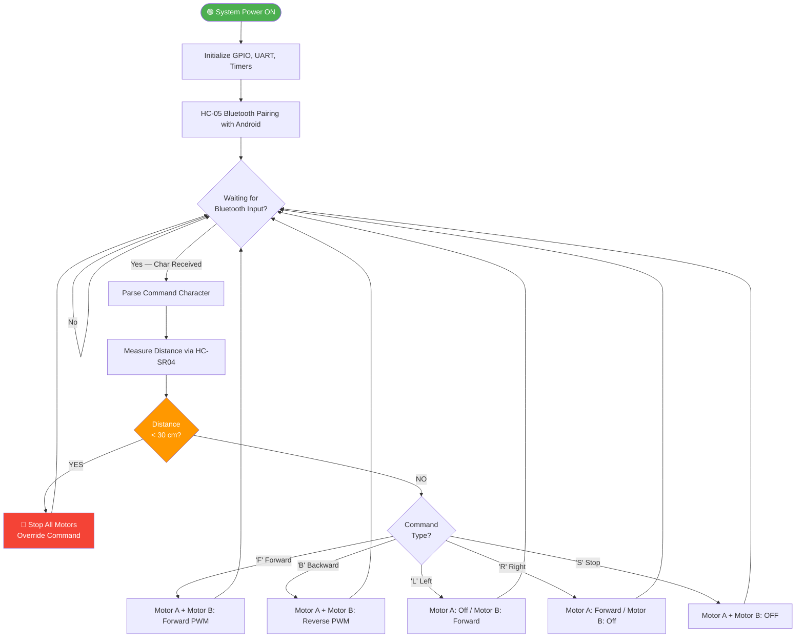
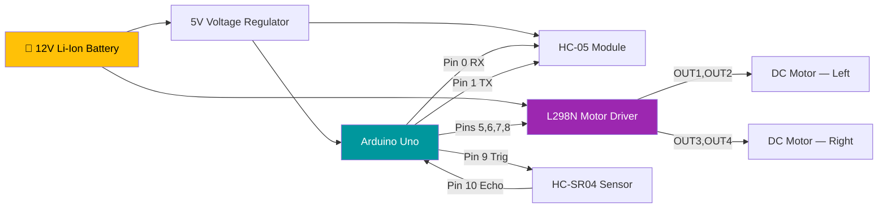
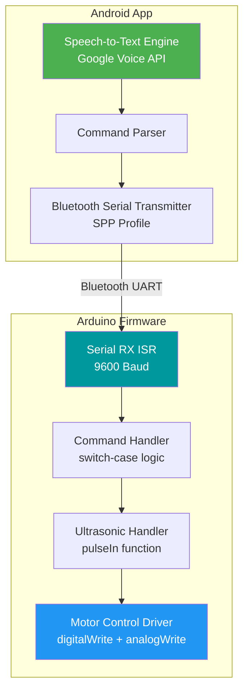

<div align="center">

# 🦽 Voice-Controlled Smart Wheelchair

### Intelligent Mobility Assistance System for Elderly & Physically Challenged Individuals

[](https://www.arduino.cc/)
[](https://en.wikipedia.org/wiki/Embedded_C)
[](https://en.wikipedia.org/wiki/Bluetooth)
[](https://en.wikipedia.org/wiki/Internet_of_things)
[](./LICENSE)
[](https://www.unipune.ac.in/)
[](https://github.com/YOUR_USERNAME/Voice-Controlled-Smart-Wheelchair)
[](https://github.com/YOUR_USERNAME/Voice-Controlled-Smart-Wheelchair)

---

> **Final Year B.E. Project** | Department of Electronics & Telecommunication  
> Trinity College of Engineering and Research, Pune — SPPU | AY 2024–25

</div>

---

## 📋 Table of Contents

- [Project Overview](#-project-overview)
- [Problem Statement](#-problem-statement)
- [Objectives](#-objectives)
- [Features](#-features)
- [Technology Stack](#-technology-stack)
- [System Architecture](#-system-architecture)
- [Hardware Architecture](#-hardware-architecture)
- [Software Architecture](#-software-architecture)
- [Workflow Diagram](#-workflow-diagram)
- [Circuit Explanation](#-circuit-explanation)
- [Component Specifications](#-component-specifications)
- [Repository Structure](#-repository-structure)
- [Installation & Setup](#-installation--setup)
- [Wiring Connections](#-wiring-connections)
- [Arduino IDE Setup](#-arduino-ide-setup)
- [Mobile App Setup](#-mobile-app-setup)
- [Usage Instructions](#-usage-instructions)
- [Working Principle](#-working-principle)
- [Testing & Results](#-testing--results)
- [Advantages](#-advantages)
- [Applications](#-applications)
- [Limitations](#-limitations)
- [Future Enhancements](#-future-enhancements)
- [References](#-references)
- [Team](#-team)
- [License](#-license)
- [Acknowledgements](#-acknowledgements)

---

## 🧾 Project Overview

The **Voice-Controlled Smart Wheelchair** is an intelligent mobility assistance system developed as part of the Final Year B.E. (Electronics & Telecommunication) project at Trinity College of Engineering and Research, Pune, affiliated with Savitribai Phule Pune University (SPPU).

The system enables elderly and physically challenged individuals to control a motorized wheelchair entirely through **voice commands** delivered via an Android smartphone over **Bluetooth communication**. An onboard **ultrasonic obstacle detection** system adds an active safety layer, automatically halting movement to prevent collisions.

This project bridges embedded systems, assistive technology, and human-computer interaction — targeting a critical real-world need: **accessible, affordable, and independent mobility**.

---

## ❗ Problem Statement

Conventional wheelchairs demand significant physical strength and coordination from the user or require a caregiver for operation. For individuals with:

- **Paralysis or limb weakness** (post-stroke, spinal cord injuries)
- **Severe arthritis or muscular dystrophy**
- **Age-related mobility disorders in elderly patients**

...traditional wheelchairs become unusable or unsafe without constant human assistance. This creates:

- **Loss of independence** for the user
- **Emotional and physical burden** on caregivers
- **Limited adoption** due to high cost of powered wheelchairs

An affordable, voice-driven alternative that can be retrofitted or newly built is a transformative solution for this demographic.

---

## 🎯 Objectives

1. Design a voice-command-based wheelchair control system using **Arduino Uno (ATmega328P)**.
2. Implement **Bluetooth-based serial communication** between an Android smartphone and the microcontroller.
3. Integrate **ultrasonic sensing (HC-SR04)** for real-time obstacle detection and collision prevention.
4. Control **DC geared motors via L298N** for directional movement: Forward, Backward, Left, Right, Stop.
5. Develop a system that is low-cost, robust, and field-deployable for assistive healthcare applications.
6. Validate the system through hardware testing and performance measurement.

---

## ✨ Features

| Feature | Description |
|---|---|
| 🎙️ Voice Control | Voice commands processed on Android, sent via Bluetooth |
| 📡 Bluetooth Communication | HC-05 module with UART serial interface |
| 🛑 Obstacle Detection | HC-SR04 ultrasonic sensor with configurable threshold |
| ⚡ Motor Control | L298N dual H-bridge driver for two DC geared motors |
| 🔋 Rechargeable Power | Li-Ion battery for extended runtime |
| 📱 Android Integration | Bluetooth SPP (Serial Port Profile) for smartphone pairing |
| 🔄 5-Direction Control | Forward, Backward, Left, Right, Stop |
| 🛡️ Auto-Stop Safety | Interrupt-driven halt on obstacle detection |
| 💰 Low Cost | Built on commodity components; affordable for broad deployment |

---

## 🛠️ Technology Stack

### Hardware
| Component | Model / Spec | Role |
|---|---|---|
| Microcontroller | Arduino Uno (ATmega328P, 16MHz) | Central processing unit |
| Bluetooth Module | HC-05 | Wireless serial communication |
| Ultrasonic Sensor | HC-SR04 | Obstacle detection |
| Motor Driver | L298N Dual H-Bridge | Motor speed and direction control |
| DC Motors | 12V DC Geared Motors (×2) | Wheelchair propulsion |
| Power Source | 12V Li-Ion Rechargeable Battery | System power supply |
| Interface Device | Android Smartphone | Voice input and BT transmission |

### Software
| Tool | Purpose |
|---|---|
| Arduino IDE | Firmware development and flashing |
| Embedded C | Microcontroller programming |
| Android Voice App | Converts speech-to-text, sends via Bluetooth |
| Serial Monitor | Debugging and communication testing |

---

## 🏗️ System Architecture

### High-Level Block Architecture



---

### Data Flow Diagram



---

### Working Algorithm



---

## ⚙️ Hardware Architecture

### Component Interconnection



---

## 💻 Software Architecture



---

## 🔌 Circuit Explanation

The circuit operates on a **two-bus power architecture**:

- **Logic Bus (5V):** Powers Arduino Uno and HC-05 Bluetooth module via a 5V LDO regulator from the 12V main battery.
- **Motor Bus (12V):** Directly powers L298N motor driver for high-torque DC motor operation.

### Signal Chain
1. **HC-05 TX → Arduino RX (Pin 0):** Receives 1-byte command characters at 9600 baud.
2. **Arduino GPIO (Pins 5–8) → L298N IN1–IN4:** Sets motor polarity for direction.
3. **Arduino PWM (Pins 5/6) → L298N ENA/ENB:** Controls motor speed via 0–255 PWM.
4. **Arduino Pin 9 → HC-SR04 Trig:** 10µs HIGH pulse triggers ultrasonic burst.
5. **HC-SR04 Echo → Arduino Pin 10:** `pulseIn()` measures echo width for distance calculation.

**Distance Formula:**  
`Distance (cm) = pulseIn(ECHO_PIN, HIGH) / 58.0`

---

## 📦 Component Specifications

| Component | Specification | Operating Voltage |
|---|---|---|
| Arduino Uno | ATmega328P, 16MHz, 32KB Flash, 2KB SRAM | 5V (USB) / 7–12V (barrel) |
| HC-05 Bluetooth | Class 2, SPP, 9600 baud default, 10m range | 3.3V logic / 5V VCC |
| HC-SR04 | 2cm–400cm range, ±3mm accuracy, 40kHz | 5V |
| L298N Motor Driver | Dual H-bridge, 2A per channel, 6–35V motor | 5V logic / 12V motor |
| DC Geared Motor | 12V, 100–200 RPM, torque ≥ 3 kg·cm | 12V DC |
| Li-Ion Battery | 12V, 2200–4400mAh, rechargeable | 12V output |

---

## 📁 Repository Structure

```
Voice-Controlled-Smart-Wheelchair/
│
├── README.md                       ← This file
├── LICENSE                         ← MIT License
├── CONTRIBUTING.md                 ← Contribution guidelines
├── CODE_OF_CONDUCT.md              ← Community standards
├── CHANGELOG.md                    ← Version history
├── .gitignore                      ← Ignore compiled + IDE files
│
├── software/
│   ├── Arduino_Code/
│   │   ├── wheelchair_main.ino     ← Main firmware source
│   │   ├── motor_control.h         ← Motor driver abstraction
│   │   └── ultrasonic.h            ← HC-SR04 utility functions
│   ├── Android_App/
│   │   └── README.md               ← Android app setup guide
│   └── Libraries/
│       └── README.md               ← Required library list
│
├── hardware/
│   ├── Circuit_Diagram.png         ← Full wiring schematic
│   ├── Block_Diagram.png           ← System block diagram
│   ├── Wiring_Details.md           ← Pin-by-pin connection table
│   └── Component_List.md           ← BOM (Bill of Materials)
│
├── docs/
│   ├── Project_Report.pdf          ← Full academic report
│   ├── Synopsis.pdf                ← Project synopsis
│   ├── Presentation.pptx           ← Demo presentation
│   └── Images/                     ← Block/flowchart diagrams
│
├── images/
│   ├── Project_Photo_1.jpg         ← Hardware assembly photos
│   ├── Project_Photo_2.jpg
│   ├── Working_Demo.gif            ← Live demo recording
│   └── Banner.png                  ← Repo banner image
│
├── results/
│   ├── Test_Results.md             ← Functional test observations
│   ├── Performance_Analysis.md     ← Timing and accuracy data
│   └── Experimental_Data.xlsx      ← Quantitative results
│
└── research/
    ├── Literature_Survey.md        ← Related work summary
    ├── References.md               ← IEEE/APA references
    └── Future_Work.md              ← Proposed extensions
```

---

## 🔧 Installation & Setup

### Prerequisites

- Arduino IDE (v1.8.x or v2.x) — [Download](https://www.arduino.cc/en/software)
- Arduino Uno board with USB-A to USB-B cable
- Android smartphone (Android 5.0+) with Bluetooth
- Bluetooth Serial Terminal app or custom voice app

### Clone the Repository

```bash
git clone https://github.com/YOUR_USERNAME/Voice-Controlled-Smart-Wheelchair.git
cd Voice-Controlled-Smart-Wheelchair
```

### Required Arduino Libraries

No external libraries required. The code uses only Arduino built-in functions:
- `Serial` — UART communication with HC-05
- `digitalWrite` / `analogWrite` — Motor and GPIO control
- `pulseIn` — HC-SR04 echo timing

---

## 🔌 Wiring Connections

### HC-05 Bluetooth Module → Arduino Uno

| HC-05 Pin | Arduino Pin | Notes |
|---|---|---|
| VCC | 5V | Power supply |
| GND | GND | Common ground |
| TX | Pin 0 (RX) | Serial data to Arduino |
| RX | Pin 1 (TX) via 1kΩ voltage divider | 5V→3.3V level shift |

### HC-SR04 Ultrasonic Sensor → Arduino Uno

| HC-SR04 Pin | Arduino Pin | Notes |
|---|---|---|
| VCC | 5V | Power supply |
| GND | GND | Common ground |
| TRIG | Pin 9 | Trigger pulse output |
| ECHO | Pin 10 | Echo pulse input |

### L298N Motor Driver → Arduino Uno

| L298N Pin | Arduino Pin | Notes |
|---|---|---|
| IN1 | Pin 5 | Motor A direction bit 1 |
| IN2 | Pin 6 | Motor A direction bit 2 |
| IN3 | Pin 7 | Motor B direction bit 1 |
| IN4 | Pin 8 | Motor B direction bit 2 |
| ENA | Pin 3 (PWM) | Motor A speed control |
| ENB | Pin 11 (PWM) | Motor B speed control |
| 12V | Battery+ | Motor power (12V DC) |
| GND | Battery− / Arduino GND | Common ground |

---

## 💻 Arduino IDE Setup

1. Open `software/Arduino_Code/wheelchair_main.ino` in Arduino IDE.
2. Select **Board:** `Arduino Uno` under *Tools > Board > Arduino AVR Boards*.
3. Select **Port:** COM port matching your connected Arduino (check Device Manager on Windows).
4. Click **Verify** (✓) to compile — should complete with 0 errors.
5. Click **Upload** (→) to flash firmware to the board.
6. Open **Serial Monitor** at **9600 baud** for debug output.

> ⚠️ **Important:** Disconnect HC-05 TX/RX pins before uploading. The bootloader shares the same UART0. Reconnect after flashing.

---

## 📱 Mobile App Setup

1. Install any **Bluetooth Serial Terminal** app (e.g., *Serial Bluetooth Terminal* by Kai Morich — available on Google Play).
2. Enable Bluetooth on your Android device.
3. Pair with **HC-05** (default PIN: `1234` or `0000`).
4. In the app, set the following command characters (configurable in firmware):

| Voice Command | Character Sent |
|---|---|
| "Forward" | `F` |
| "Backward" / "Reverse" | `B` |
| "Left" | `L` |
| "Right" | `R` |
| "Stop" | `S` |

5. Alternatively, use a **Voice Control App** that maps speech-to-text output to serial characters over Bluetooth SPP.

---

## 🚀 Usage Instructions

1. Power the wheelchair system via the 12V Li-Ion battery.
2. The LED on HC-05 will blink rapidly — indicating it's in pairing mode.
3. Connect from your Android app; HC-05 LED will blink slowly (connected).
4. Speak or tap directional commands in the app.
5. The wheelchair responds within ~100ms of command reception.
6. If the ultrasonic sensor detects an obstacle within **30 cm**, the wheelchair auto-stops regardless of the active command.
7. Move the obstacle away or issue a **backward/turn** command to resume.

---

## 🧠 Working Principle

The system operates on a **master–slave command architecture**:

1. **User Voice Input:** The Android app captures voice via the smartphone microphone and uses Google's Speech-to-Text engine to convert spoken words into text.
2. **Command Parsing:** The app maps recognized keywords (Forward, Back, Left, Right, Stop) to single-character command bytes.
3. **Bluetooth Transmission:** The command byte is sent over Bluetooth SPP to the HC-05 module, which delivers it via UART serial to Arduino's RX pin.
4. **Firmware Decision Logic:** The Arduino first polls the HC-SR04 sensor. If the distance is above threshold (30 cm), it executes the motor control logic corresponding to the received command.
5. **Motor Execution:** The L298N receives HIGH/LOW direction signals and a PWM duty cycle, driving the left and right DC motors accordingly to achieve forward, backward, left-pivot, or right-pivot motion.

---

## 🧪 Testing & Results

### Functional Test Summary

| Test Case | Expected Output | Result |
|---|---|---|
| "Forward" command received | Both motors run forward | ✅ PASS |
| "Left" command received | Right motor runs, Left stops | ✅ PASS |
| Obstacle at 20cm — any command | Motors halt immediately | ✅ PASS |
| Obstacle removed — "Forward" | Motors resume forward | ✅ PASS |
| No BT connection — button press | No motor response | ✅ PASS |
| BT pairing range test (10m) | Commands execute correctly | ✅ PASS |

### Performance Metrics

| Metric | Measured Value |
|---|---|
| Bluetooth latency (command to motor) | ~80–120 ms |
| Obstacle detection response time | < 60 ms |
| Ultrasonic measurement accuracy | ±3 mm @ 2–200 cm |
| HC-05 pairing range (open field) | ~10 metres |
| Battery runtime @ full load | ~4–6 hours |

---

## ✅ Advantages

- **Non-invasive control** — no physical effort required from the user
- **Low cost** — built with commodity components under ₹3,000
- **Retrofittable** — can be adapted to any standard manual wheelchair frame
- **Real-time obstacle safety** — prevents collisions autonomously
- **Wireless** — no wired remote or joystick needed
- **Expandable** — GPS, IoT monitoring, and gesture control can be added

---

## 🏥 Applications

- Elderly care homes and assisted living facilities
- Rehabilitation centres and hospitals
- Physically challenged individuals with upper-limb paralysis
- Post-surgical mobility assistance
- Smart home and accessibility infrastructure

---

## ⚠️ Limitations

- Voice recognition accuracy depends on ambient noise levels
- HC-05 Bluetooth range limited to ~10m (line-of-sight)
- Ultrasonic sensor has a ~15° cone of detection — side obstacles may be missed
- Single ultrasonic sensor — rear and side blind spots exist
- No GPS or remote monitoring capability in current version

---

## 🔮 Future Enhancements

- **Multi-sensor obstacle detection** (4× HC-SR04 for 360° coverage)
- **Camera-based navigation** with Raspberry Pi and OpenCV
- **IoT cloud monitoring** — real-time GPS tracking via MQTT/ThingSpeak
- **Gesture-based control** using MPU-6050 IMU
- **Emergency alert system** — panic button triggers SMS via GSM module
- **Automated path following** using IR line tracking
- **EEG-based control** for fully paralyzed users (research-level extension)

---

## 📚 References

1. K. Arun et al., "Voice Controlled Wheelchair using Arduino," *International Journal of Engineering Research & Technology (IJERT)*, vol. 7, 2018.
2. P. Tiwari et al., "Smart Wheelchair System for Physically Challenged Persons," *IEEE International Conference on Recent Trends in Electronics*, 2019.
3. S. Kumar et al., "Obstacle Avoidance and Voice Controlled Wheelchair," *IJCST*, vol. 10, 2021.
4. Texas Instruments, *L298N Dual Full-Bridge Driver Datasheet*, Rev. 2019.
5. Atmel Corporation, *ATmega328P Datasheet*, Rev. 2014.
6. HC-05 Bluetooth Module AT Command Reference, Version 2.0.

---

## 👥 Team

| Name | Roll No. | LinkedIn |
|---|---|---|
| **Vaibhav Jagtap** | B400650099 | [linkedin.com/in/vaibhavjagtap](https://linkedin.com/in/vaibhavjagtap) |
| Suraksha Vedpathak | — | — |
| Tirthesh Pol | — | — |

**Project Guide:** Dr. Pratibha Chavan  
**Department:** Electronics & Telecommunication  
**Institute:** Trinity College of Engineering and Research, Pune  
**University:** Savitribai Phule Pune University (SPPU)  
**Academic Year:** 2024–25

---

## 📄 License

This project is licensed under the **MIT License** — see [LICENSE](./LICENSE) for details.

---

## 🙏 Acknowledgements

We sincerely thank **Dr. Pratibha Chavan** for her invaluable guidance and continuous support throughout this project. We are grateful to the Department of Electronics & Telecommunication, Trinity College of Engineering and Research, Pune, and all faculty members who provided resources, laboratory access, and feedback during the development of this system.

---

<div align="center">

**⭐ Star this repo if you found it useful!**  
*Built with ❤️ at TCOER Pune — BE E&TC Final Year Project, 2024–25*

</div>
